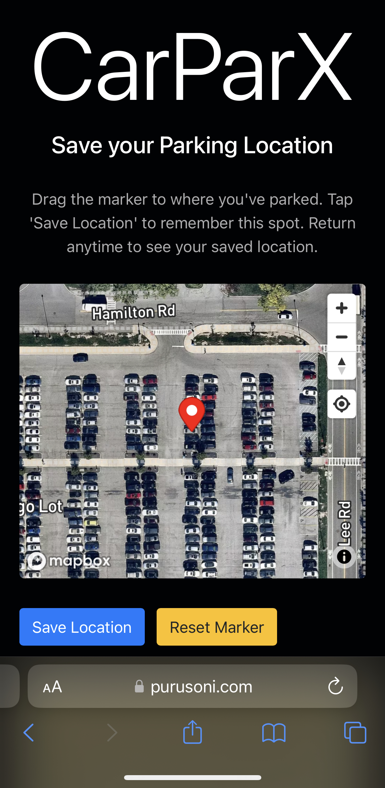

# CarParX

A simple, user-friendly tool to help you remember where you parked your car.

## Overview

Ever walked out of a mall, concert, or a big event and forgot where you parked? CarParX is here to help. With just a few taps, you can save your car's location and easily find it later.

## Features

- **Save Your Parking Spot:** Drag the marker to your parking spot and save it with a single click.
- **Mobile Friendly:** Designed to be easily accessible and usable on smartphones.
- **Privacy First:** Your parking location is stored in your browser's local storage, not on any server.

## How to Use

1. Open [CarParX](https://purusoni.com/car) [(purusoni.com/car)](https://purusoni.com/car)] on your mobile browser.
2. Grant location access to the app.
3. Drag the marker to your parking location.
4. Tap 'Save Location' to remember your parking spot.
5. Return anytime to the site to see your saved parking location.

## Built With

- **Mapbox:** For rendering maps and providing geolocation services.
- **Bootstrap:** For a beautiful UI and mobile-responsive design.

## Deployment

CarParX is hosted and can be accessed at [purusoni.com/car](https://purusoni.com/car)

## Contributing

Pull requests are welcome. For major changes, please open an issue first to discuss what you would like to change

## License

This project is [MIT](LICENSE) licensed.

